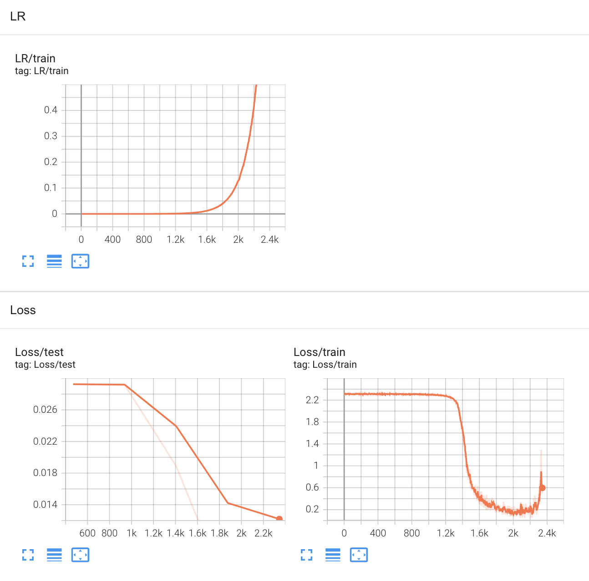
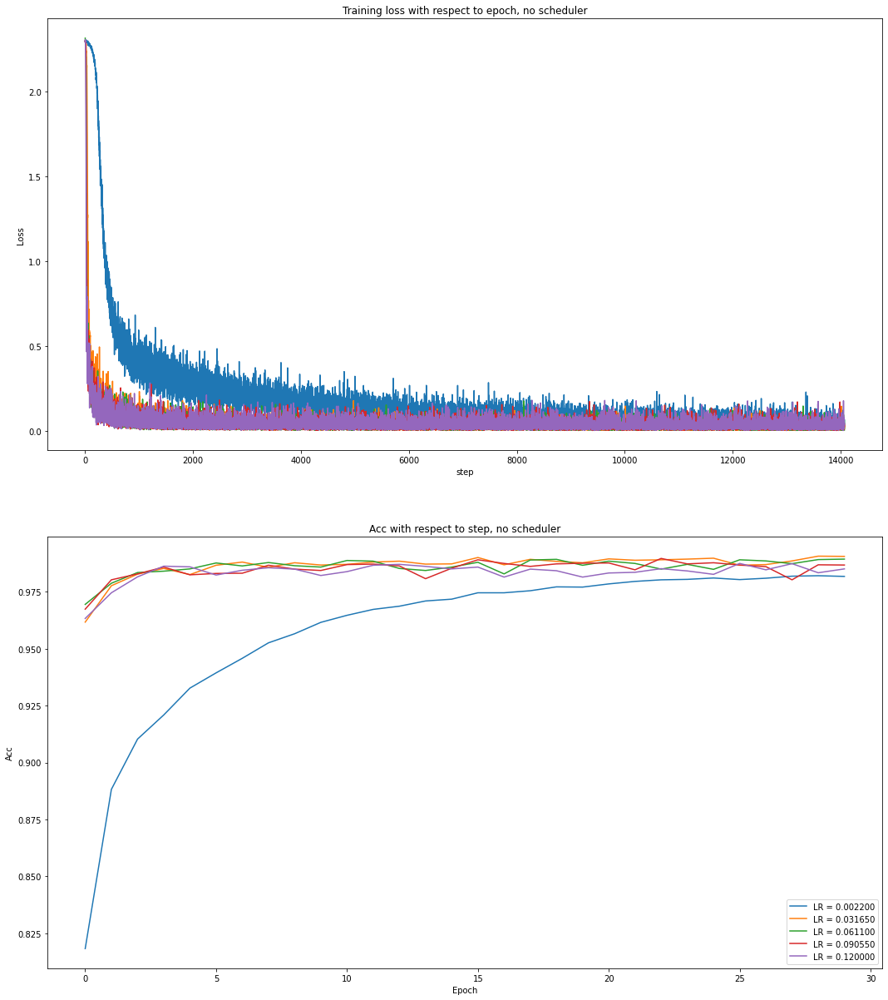
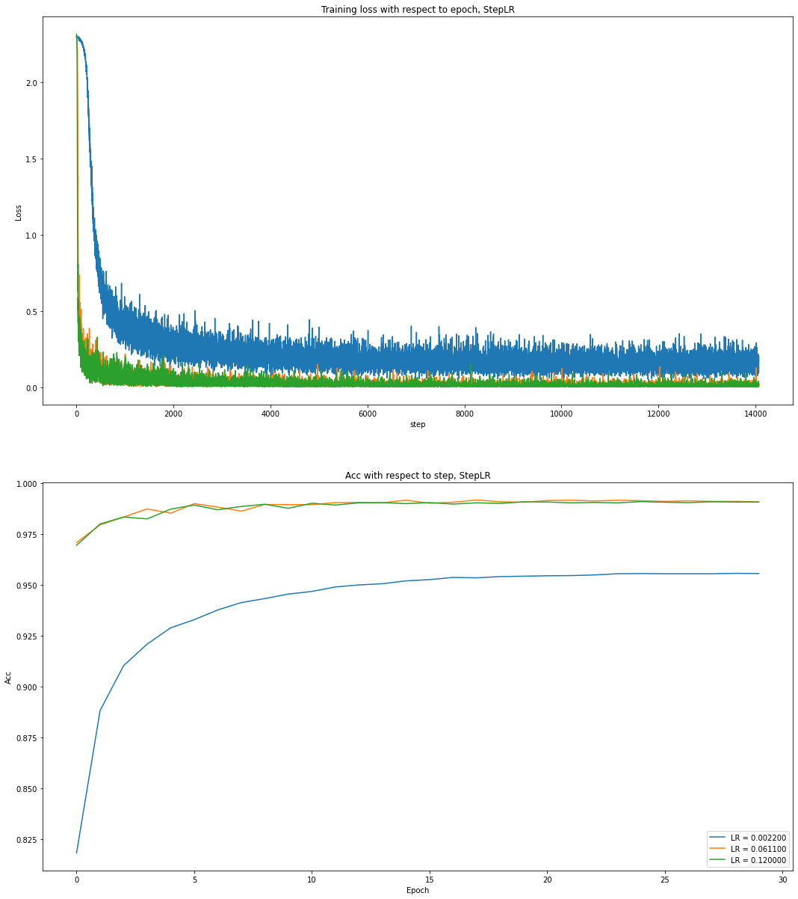
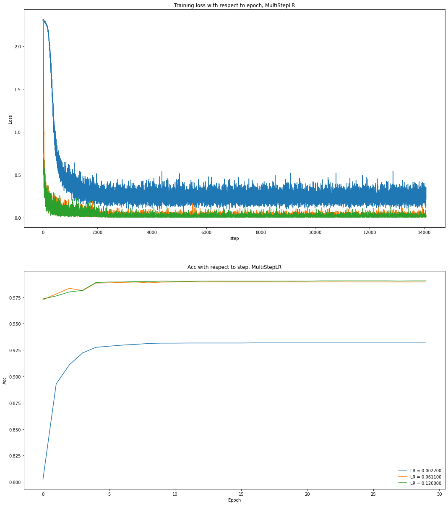

# Super Convergence With ColossalAI

#### - CS5260 Assignment 6: Super Fast Learning Rate Range Test with [Colossal AI](https://github.com/hpcaitech/ColossalAI)

This repo serves as my solution for assignment 6 in NUS CS5260 22Spring: Neural Network and Machine Learning II, instructed by [Prof. Yang You](https://www.comp.nus.edu.sg/~youy/).

## Features

Colossal-AI provides a collection of parallel training components for you. It aims to support you to write your distributed deep learning models just like how you write your model on your laptop. It provides user-friendly tools to kickstart distributed training in a few lines.

## Installation

```
pip install -r requirements.txt
```

This command will install CUDA extension if your have installed CUDA, NVCC and torch.

## Learning Rate Range Test with Colossal AI

This example uses LeNet5 to do the classification task on MNIST. Considering the excellent performance of SGD on computer vision tasks, this example is done using SGD with momentum.

Other high-performance training optimizers, such as LAMB, LARS, etc., can be explored in the future.

### Range Test



- Learning rate range test results using [*Super-Convergence: Very Fast Training of Neural Networks Using Large Learning Rates*](https://arxiv.org/abs/1708.07120)
- This experiment is done with Colossal AI to conduct very far range test
- By observing the traning loss, it can be considered that LRs from 2.2e-3 to 1.2e-1 are available (corresponding to steps from 1.3k to 2k).

## Evaluation on SGD with momentum: with different Schedulers

In this experiment, `num` learning rates are selected from 2.2e-3 to 1.2e-1, where `num=5` for experiments with no schduler, `num=3` for experiments with other schedulers for simplicity.

```python
lr_range = np.log10(np.logspace(start=2.2e-3, stop=1.2e-1, num=5, endpoint=True)) 
# array([0.0022 , 0.03165, 0.0611 , 0.09055, 0.12   ])
# experiments with no schduler

lr_range_simple = np.log10(np.logspace(start=2.2e-3, stop=1.2e-1, num=3, endpoint=True))
# array([0.0022, 0.0611, 0.12  ])
# experiments with other schedulers for simplicity
```

### With NO Scheduler

Do not use any scheduler.

Training loss and test acc are presented as follows.



For these experiments, all the selected learning rates perform very well. Even using the worst one: LR = 0.1200, the traning loss ca n still convergy and test acc can achieve a satisfactory performance.

### With StepLR

Using StepLR, learning rate decreased by `gamma=0.5` after every 2000 optimization steps.

Training loss and test acc are presented as follows.



The results are as expected that these selected learning rates can quickly convergy. Especially when `LR=0.0022` and `LR=0.0611`, these two learning rates can make the training loss almost converge within 1000 optimization steps.

### With MultiStepLR

Using MultiStepLR, learning rate decreased by `gamma=0.1` at `milestone=[2000, 4000, 6000]`.

Training loss and test acc are presented as follows.



The results obtained are like StepLR and the performance is as expected. All these experiments can prove that the learning rate selected by super-convergence is very reliable. These selected learning rates can perform very well under different schedulers.

## Conclusion

The super fast learning rates selection method proposed in [*Super-Convergence: Very Fast Training of Neural Networks Using Large Learning Rates*](https://arxiv.org/abs/1708.07120) is very useful, which is illurstarted in extensive experiments. Further analysis can be done using other popular optimizers like [Adam](https://arxiv.org/abs/1412.6980), [LAMB](https://arxiv.org/abs/1904.00962) and [LARS](https://arxiv.org/abs/1708.03888).

Colossal AI can be regarded as a powerful helper when conduct large size traning. To achieve super-convergence goals, we can use Colossal AI to select a range of learning rates in very few epochs for specific optimizers, then the selected learning rates can be used in real large size traning and saves a lot of resources for parameter tuning. Combining these two method or tool, super-convergence and Colossal AI, researchers and engineers can quickly deploy  large-scale distributed machine learning models anytime, anywhere.


## Reference

- [Super-Convergence: Very Fast Training of Neural Networks Using Large Learning Rates](https://arxiv.org/abs/1708.07120)
  - Smith, Leslie N., and Nicholay Topin.
- [Large Batch Training of Convolutional Networks](https://arxiv.org/abs/1708.03888)
  - You, Yang, Igor Gitman, and Boris Ginsburg.

- [Large Batch Optimization for Deep Learning: Training BERT in 76 minutes](https://arxiv.org/abs/1904.00962)
  - You, Yang, Jing Li, Sashank Reddi, Jonathan Hseu, Sanjiv Kumar, Srinadh Bhojanapalli, Xiaodan Song, James Demmel, Kurt Keutzer, and Cho-Jui Hsieh.
